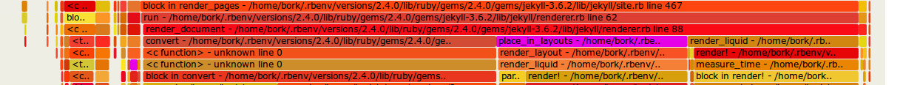

# Using flamegraphs

## What's a flamegraph?

Here's a very basic introduction to [flamegraphs](http://www.brendangregg.com/flamegraphs.html).
Everything in here is true for flamegraphs in general, not just the flamegraphs rbspy generates.

Flamegraphs are a way to visualize how your program is spending its time. A few important things
about flamegraphs:

* The x axis on the flamegraph doesn't represent time.
* The SVGs have Javascript in them and they're interactive! You can search with ctrl+f!
* You can't tell from a flamegraph how many times a function was called. You can only tell how much
  time was spent in the function.

## Reading a flamegraph

Flamegraphs are generated from a series of stack traces. To get an idea for how this works, let's
pretend that our profiler has collected 4 stack traces, as follows.

```
a;d 1
b;d 1
a;b;c 1
a;b;c;d 1
```

Here's the flamegraph. It's generated by sorting the above stack traces (so that all the `a`s are
together) and arranging them vertically into a chart. In this one, the main method is at the top.

<a href="../static/images/simplest-flamegraph.svg">

</a>

What this tells us is:

* 75% (3/4) of the stack traces we collected started in the `a` function
* 50% (2/4) of the stack traces started with `a` calling `b` and then calling `c`.


## A simple real example

To get a tiny bit more complicated -- here's a very simple Ruby program that spends 20% of its time
running the `panda` function, and 80% of its time running the `cucumber` function.

```
def panda
    sleep(0.20)
end

def potato
    cucumber
end

def cucumber
    sleep(0.80)
end

loop do
    panda
    potato
end
```

Here's the flamegraph! There's a `panda` bar in the flame graph that takes up 20% of the x axis, and
`potato` and `cucumber` bars that take up 80% of the x axis. This means that 80% of the time was
spent in `potato`/`cucumber` and 20% in `panda`.

<a href="../static/images/basic-flamegraph.svg">

</a>

If you click on the above flamegraph, you'll get an interactive SVG -- you can hover over any part
of the flamegraph to get the % of samples that were in that function. In this example, 79.37% of the
samples were in the `potato` function.


## A more complicated flamegraph: Jekyll

Here's a much more complicated flamegraph generated by `rbspy`. The way I usually read flamegraphs
is to look for big wide sections (because they represent a large part of the program's execution)

There are 2 things that jump out to me about this flamegraph:

* there's an `initialize` function where 5.9% of the time is spent. Not that much time is being
  spent in initialization!
* 86.6% of the time is spent in `process_site`, and if you look a little further down, you can see
  that `render_document` splits into 3 separate functions: `convert`, `place_in_layouts`, and
  `render_liquid`. That means that `render_document` called those 3 methods, and that, while
  `render_document` did call other methods, it didn't spend a substantial amount of time in any
  other method.

This is neat! I'm not familiar with the Jekyll codebase at all, but just by looking through this
flamegraph I can understand a few important things about how the code is structured.

Here's the slice that jumps out at me (where `render_document` splits into the 3 methods it calls).
Basically the thing to look for here is where the big slice (which takes up ~80% of the program)
breaks into smaller slices, because that tells you what the program's main phases are.



and the whole flamegraph:

<a href="../static/examples/jekyll-flamegraph.svg">

</a>

## When don't flamegraphs work well? (recursion!)

Flamegraphs don't work well with highly recursive programs. When you have a program with a lot of
recursion, what will happen is that the function you're calling recursively will appear over and
over again multiple times in each stack trace. If you have a very recursive program that you want to
analyze in depth, using a `callgrind` visualization instead might work better.

For example, Rubocop uses a lot of recursion. In this flamegraph from a Rubocop execution, we see
that the `on_block`, `on_begin`, `on_while`, etc functions get called over and over and over again
in a lot of different places, and it's very hard to learn anything from the flamegraph except that
there's a lot of recursion.

<a href="../static/images/rubocop-flamegraph.svg">

</a>

A simple text summary gives us more insight into what's going on (7.6% of the time is spent in
`advance`!) than the flamegraph does.

```
Summary of profiling data so far:
% self  % total  name
  7.65     8.99  advance - /home/bork/.rbenv/versions/2.4.0/lib/ruby/gems/2.4.0/gems/parser-2.4.0.2/lib/parser/lexer.rb
  4.83    11.31  each_child_node - /home/bork/.rbenv/versions/2.4.0/lib/ruby/gems/2.4.0/gems/rubocop-0.52.1/lib/rubocop/ast/node.rb
  3.66     8.65  block in tokens - /home/bork/.rbenv/versions/2.4.0/lib/ruby/gems/2.4.0/gems/rubocop-0.52.1/lib/rubocop/cop/mixin/surrounding_s
  3.33     3.33  source_range - /home/bork/.rbenv/versions/2.4.0/lib/ruby/gems/2.4.0/gems/rubocop-0.52.1/lib/rubocop/ast/node.rb
  2.50    29.28  block (2 levels) in on_send - /home/bork/.rbenv/versions/2.4.0/lib/ruby/gems/2.4.0/gems/rubocop-0.52.1/lib/rubocop/cop/commiss
  2.50     2.50  block in offensive? - /home/bork/.rbenv/versions/2.4.0/lib/ruby/gems/2.4.0/gems/rubocop-0.52.1/lib/rubocop/cop/style/commented
  2.50     2.50  block (2 levels) in find_common_characters - /home/bork/.rbenv/versions/2.4.0/lib/ruby/gems/2.4.0/gems/rubocop-0.52.1/lib/rubo
  2.16     9.65  block in each_child_node - /home/bork/.rbenv/versions/2.4.0/lib/ruby/gems/2.4.0/gems/rubocop-0.52.1/lib/rubocop/ast/node.rb
  1.83    15.31  do_parse - /home/bork/.rbenv/versions/2.4.0/lib/ruby/2.4.0/racc/parser.rb
  1.83     1.83  to_s - /home/bork/.rbenv/versions/2.4.0/lib/ruby/gems/2.4.0/gems/rubocop-0.52.1/lib/rubocop/cop/badge.rb
  1.83     1.83  rspec_pattern - /home/bork/.rbenv/versions/2.4.0/lib/ruby/gems/2.4.0/gems/rubocop-rspec-1.22.0/lib/rubocop/cop/rspec/cop.rb
  1.66     2.66  cop_config - /home/bork/.rbenv/versions/2.4.0/lib/ruby/gems/2.4.0/gems/rubocop-0.52.1/lib/rubocop/cop/cop.rb
  1.50     1.50  end_pos - /home/bork/.rbenv/versions/2.4.0/lib/ruby/gems/2.4.0/gems/rubocop-0.52.1/lib/rubocop/token.rb
  1.33     1.50  style_detected - /home/bork/.rbenv/versions/2.4.0/lib/ruby/gems/2.4.0/gems/rubocop-0.52.1/lib/rubocop/cop/mixin/configurable_e
  1.16     2.00  to_a - /home/bork/.rbenv/versions/2.4.0/lib/ruby/gems/2.4.0/gems/ast-2.3.0/lib/ast/node.rb
  1.16     1.16  initialize - /home/bork/.rbenv/versions/2.4.0/lib/ruby/gems/2.4.0/gems/rubocop-0.52.1/lib/rubocop/cop/cop.rb
  1.16     1.16  block (2 levels) in of - /home/bork/.rbenv/versions/2.4.0/lib/ruby/gems/2.4.0/gems/unicode-display_width-1.3.0/lib/unicode/dis
  1.00     9.48  tokens - /home/bork/.rbenv/versions/2.4.0/lib/ruby/gems/2.4.0/gems/rubocop-0.52.1/lib/rubocop/cop/mixin/surrounding_space.rb
  1.00     2.50  block (2 levels) in <class:Node> - /home/bork/.rbenv/versions/2.4.0/lib/ruby/gems/2.4.0/gems/rubocop-0.52.1/lib/rubocop/ast/no
  1.00     2.16  block in on_module - /home/bork/.rbenv/versions/2.4.0/lib/ruby/gems/2.4.0/gems/rubocop-0.52.1/lib/rubocop/cop/commissioner.rb
```
